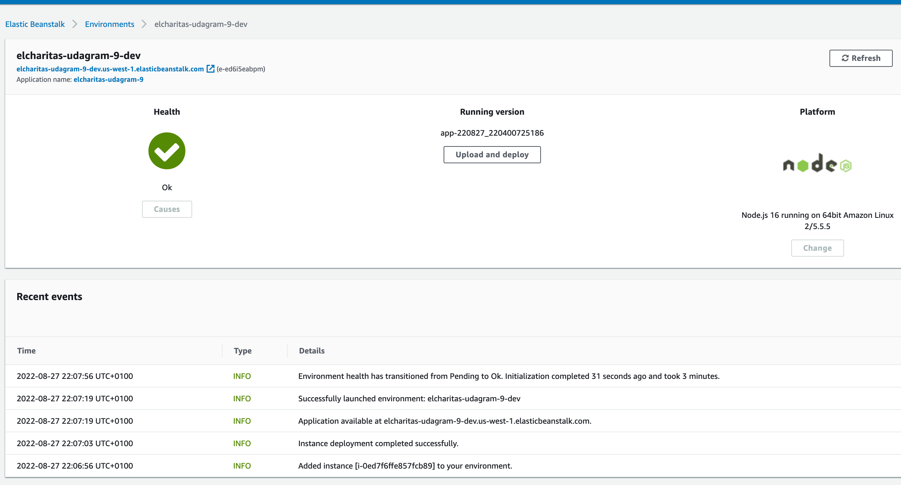

# Udagram Image Filtering Microservice

> Udagram is a simple cloud application developed alongside the Udacity Cloud Engineering Nanodegree.
> It allows users to register and log into a web client, post photos to the feed, and process photos using an image filtering microservice.

## Deployment Information

This NodeJS based microservice api was deployed on aws elastic beanstalk with the following details

* Region: US West (N.California)
* Platform: NodeJS v16

**Endpoint URL**: https://elcharitas-udagram-9-dev.us-west-1.elasticbeanstalk.com

## Testing

To run tests, you can open up the [postman collection](./cloud-cdnd-c2-final.postman_collection.json) and set the HOST to endpoint url above.
